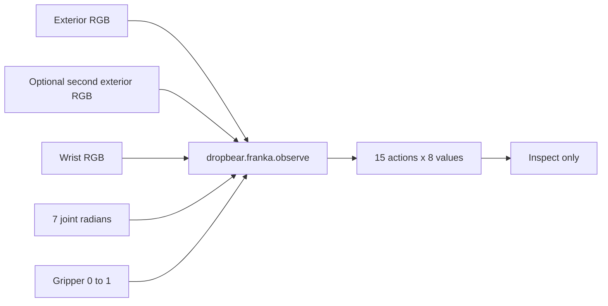

Dropbear exposes MolmoAct2-DROID inference through
`dropbear.franka.observe()`. You provide camera frames and robot state; Dropbear
returns a 15-step absolute action chunk. This guide stops before actuation
because the SDK does not ship a Franka safety controller.

<Warning>
  Do not send the result below to a robot. A Franka controller must validate
  joint, velocity, acceleration, workspace, collision, gripper, watchdog,
  hold, and physical e-stop behavior locally.
</Warning>

## 1. Install and diagnose

Use the base SDK alongside your existing Franka controller:

```bash
uv add "dropbear=={{sdkVersion}}"
uv tool install "dropbear=={{sdkVersion}}"
dropbear login
dropbear doctor
dropbear status --model molmoact2-droid
```

The status command must show available DROID capacity for the region you intend
to use. It does not open a session.

## 2. Preserve the model ordering



All images must be H×W×3 `uint8` RGB arrays. Joint state is seven values in
your controller's Franka order, expressed in radians. The gripper state is
normalized from 0 (open) to 1 (closed).

If you omit `second_exterior_frame`, the worker uses the first exterior view
for the checkpoint's second exterior input.

## 3. Request one chunk

Save this as `franka_prediction.py` and map the four controller reads to your
stack:

```python
import dropbear

from my_franka_stack import controller


exterior_rgb = controller.read_exterior_rgb()
wrist_rgb = controller.read_wrist_rgb()
joint_radians = controller.read_joint_positions()
gripper_position = controller.read_gripper_position()

observation = dropbear.franka.observe(
    exterior_frame=exterior_rgb,
    wrist_frame=wrist_rgb,
    joint_positions=joint_radians,
    gripper=gripper_position,
)

with dropbear.connect(model="molmoact2-droid") as policy:
    result = policy.predict(
        observation,
        instruction="pick up the green block",
    )
    print(f"session={policy.session_id}")
    print(f"region={policy.region}")
    print(f"transport={result.transport_mode}")
    print(f"latency_ms={result.timing.obs_to_action_ms:.1f}")

print(f"shape={len(result.actions)}x{len(result.actions[0])}")
assert len(result.actions) == 15
assert all(len(action) == 8 for action in result.actions)
print("Stopped before actuation.")
```

Run it:

```bash
uv run python franka_prediction.py
```

Expected result:

```text
shape=15x8
Stopped before actuation.
```

Each row is:

```text
[joint_0, joint_1, joint_2, joint_3, joint_4, joint_5, joint_6, gripper]
```

The joint targets are absolute radians; the gripper target is in `[0, 1]`.

## 4. Build the missing safety layer

Before any motion experiment, your local controller needs:

1. an explicit mapping between model and controller joint order;
2. hard position, velocity, acceleration, and jerk limits;
3. workspace and self/environment collision constraints;
4. per-action finite-value and timestamp checks;
5. a disconnect watchdog that commands a tested hold or stop;
6. a physical e-stop independent of the Dropbear process;
7. a low-speed, reduced-workspace validation plan with an operator present.

Only after those controls are reviewed and tested should you connect the
`RobotIO.apply_action()` boundary from the [Python quickstart](/quickstart).
Dropbear's supported public surface ends at the returned action chunk.

Need help validating the contract? Email
[{{supportEmail}}](mailto:{{supportEmail}}).
