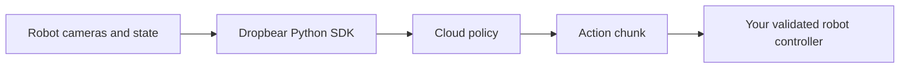

# Cloud inference for your robot

Dropbear runs robot policies in the cloud while your local controller keeps
ownership of sensing, actuation, and safety.

<CardGroup cols={2}>
  <Card title="Integrate with Python" icon="code" href="/quickstart">
    Send one real robot observation and inspect the returned action chunk
    without moving the robot.
  </Card>
  <Card title="Set up an SO-101" icon="robot" href="/guides/so101">
    Configure, calibrate, diagnose, dry-run, and safely start the supported arm
    workflow.
  </Card>
</CardGroup>

## What Dropbear owns

- authenticated cloud sessions;
- policy worker allocation and startup;
- observation transport and action-chunk delivery;
- automatic QUIC-to-relay transport selection;
- session lifecycle and usage reporting.

## What you own

- cameras and robot state;
- conversion into the selected model's observation contract;
- action validation and robot-coordinate conversion;
- local watchdogs, limits, collision handling, and e-stop behavior;
- deterministic session cleanup.

<Note>
  Open sessions consume prepaid credits. Use a context manager or call
  `close()` when work is complete. View current availability, balance, and
  usage in the
  [dashboard](https://dropbear.dreamscalelabs.com/dashboard).
</Note>

## Choose your next step

- Have a controller already? Start with the [Python quickstart](/quickstart).
- Need package or platform details? Read [Installation](/installation).
- Need exact shapes and units? Open [Model contracts](/sdk/model-contracts).
- Something failed? Use [Troubleshooting](/troubleshooting).
