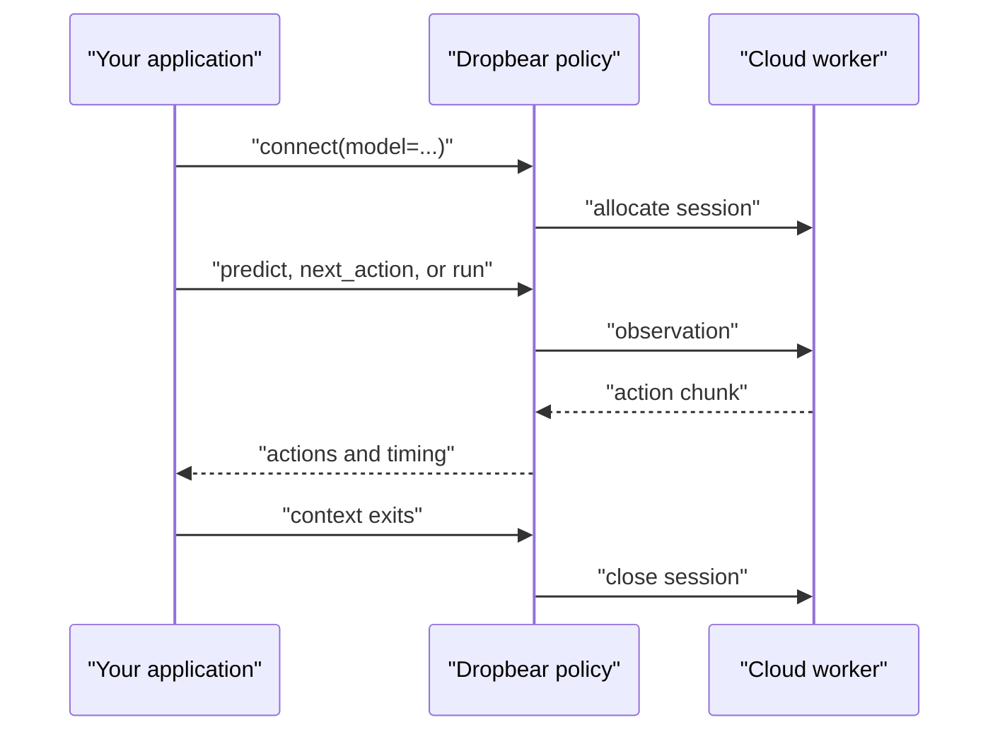

The public Python lifecycle is small: build a model-shaped observation, open a
policy, choose one prediction interface, and close the policy deterministically.



## Connect and close

Use a context manager for the synchronous SDK:

```python
import dropbear


with dropbear.connect(model="molmoact2-so101") as policy:
    print(policy.session_id)
    print(policy.region)
    print(policy.transport_mode)
```

Use `aconnect()` when your application already owns an async event loop:

```python
import asyncio

import dropbear


async def main() -> None:
    policy = await dropbear.aconnect(model="molmoact2-so101")
    async with policy:
        print(policy.session_id)


asyncio.run(main())
```

If a context manager is impossible, call `policy.close()` or
`await policy.close()` in a `finally` block.

<Note>
  Open sessions consume prepaid credits. Deterministic closure matters even
  when inference has stopped. Inspect open sessions with
  `dropbear sessions list`, and terminate an abandoned session with
  `dropbear sessions stop <session-id>`.
</Note>

## Choose a prediction interface

| Method | Returns | Ownership |
| --- | --- | --- |
| `predict()` | One complete action chunk plus timing | You own all buffering and actuation |
| `next_action()` | One action from a stateful client-side buffer | You own sensing, cadence, validation, and actuation |
| `run()` | A `RunResult` after a bounded loop | Dropbear owns refill timing; your callbacks own sensing and actuation |

### Inspect a chunk with `predict`

`predict()` sends one observation and does not actuate:

```python
result = policy.predict(
    observation,
    instruction="pick up the red cube",
    timeout_s=60.0,
)

print(len(result.actions), len(result.actions[0]))
print(result.timing.obs_to_action_ms)
print(result.transport_mode)
```

### Drive a caller-owned loop with `next_action`

`next_action()` refills its internal action buffer as needed. Validate every
returned action before applying it:

```python
import time


period_s = 1.0 / policy.action_hz
while controller.is_running():
    tick = time.perf_counter()
    observation = robot.read_observation()
    action = policy.next_action(
        observation,
        instruction="pick up the red cube",
    )
    robot.validate_action(action)
    robot.apply_action(action)
    time.sleep(max(0.0, period_s - (time.perf_counter() - tick)))
```

On any timeout, disconnect, invalid action, or local fault, stop applying new
actions and invoke your robot-side hold or stop path.

### Run a bounded loop with `run`

`run()` calls `observe`, validates the returned model object, buffers action
chunks, and calls `act` up to `max_actions`:

```python
import dropbear
from dropbear.policy import RunContext

from robot_adapter import robot


def observe(context: RunContext):
    return robot.read_observation()


def act(action, context: RunContext):
    robot.validate_action(action)
    robot.apply_action(action)
    return False


with dropbear.connect(model="molmoact2-so101") as policy:
    outcome = policy.run(
        instruction="pick up the red cube",
        observe=observe,
        act=act,
        max_actions=300,
    )

print(outcome.actions, outcome.underruns, outcome.elapsed_s)
```

The callback is the actuation boundary. Do not use this example until the
embodiment-specific limits, watchdog, collision behavior, and physical e-stop
are tested locally.

## Region and transport

Leave both settings on their defaults first:

```python
with dropbear.connect(
    model="molmoact2-so101",
    region="nearest",
    transport="auto",
) as policy:
    print(policy.region, policy.transport_mode)
```

- `region="nearest"` selects the closest configured capacity.
- `region="available"` may select another supported region when the nearest
  region has no capacity.
- `region="ap-southeast-2"`, `"us-west-2"`, `"us-east-1"`, or
  `"eu-central-1"` requests a specific region.
- `transport="auto"` tries QUIC and can fall back to the hosted relay.
- `transport="quic"` requires the UDP path.
- `transport="relay"` uses the relay directly.

## Command rate

Models declare a native action rate. `control_hz` requests a different rate for
your control loop:

```python
with dropbear.connect(
    model="dreamzero-yam",
    control_hz=15,
) as policy:
    ...
```

Dropbear stretches the action horizon to match rather than discarding actions,
so a chunk covers proportionally more wall-clock time at a lower rate. For a
24-step chunk that is 0.8 s at 30 Hz and 1.6 s at 15 Hz.

Lower rates buy buffer against a slow round trip, at the cost of responsiveness.
Leave it unset to run at the model's native rate. See
[Model contracts](/sdk/model-contracts) for each model's native rate and
supported range.

## Keeping a session warm

A cold model loads weights and warms up before it serves, which dominates the
first connection. Two settings control that window:

- `startup_timeout` bounds how long `connect()` waits for a cold model. Raise it
  for large models on a slow first call.
- `keep_warm` asks Dropbear to hold the session ready between calls instead of
  releasing it. A warm session bills while it is held, so use it for an
  interactive session or a batch of evaluations, not for an idle process.

## Progress, hooks, and timeouts

`connect()` prints lifecycle progress by default. Supply a callback to route
messages into your logger, or `None` to suppress them:

```python
with dropbear.connect(
    model="molmoact2-so101",
    on_progress=lambda message: logger.info("dropbear: %s", message),
) as policy:
    ...
```

`RunHooks` provides structured action, timing, and buffer events for a
`run()` call:

```python
import dropbear


hooks = dropbear.RunHooks(
    on_timing=lambda event: print(event.obs_to_action_ms),
    on_buffer=lambda event: print(event.health, event.remaining),
)
```

`predict()` and `next_action()` default to a 60-second response timeout. Set
`timeout_s` from your application fault budget. `idle_timeout` controls the
cloud session's inactivity limit and defaults to 3600 seconds; it is not a
substitute for closing the session.

## Optimization overrides

`acceleration`, `control`, `rtc`, and `calibration` are advanced connection
overrides. Keep each on `"auto"` unless Dropbear support asks you to test a
specific configuration:

```python
policy = dropbear.connect(
    model="molmoact2-so101",
    acceleration="auto",
    control="auto",
    rtc="auto",
    calibration="auto",
)
policy.close()
```

The resolved configuration is available as
`policy.resolved_optimization_config` for diagnostics.

## Migrating existing SO-101 code

`connect_so101()` is a deprecated compatibility surface for the legacy
turnkey SO-101 loop. New integrations should build observations with
`dropbear.so101.observe()` and connect through `dropbear.connect()`. Existing
users can continue the [SO-101 guide](/guides/so101) while migrating their
controller boundary.

Next, confirm the exact camera, state, and action ordering in
[Model contracts](/sdk/model-contracts).
